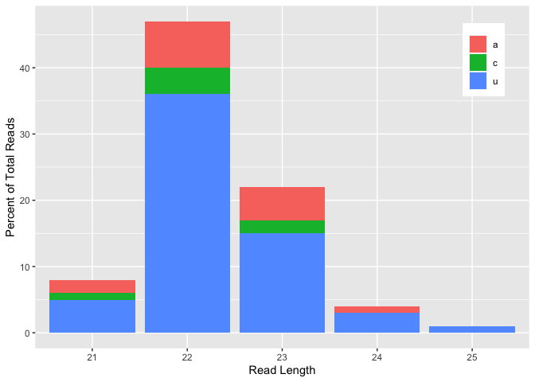

mirdeep_analysis
================
Brecia Douglas
2024-02-02

Loading in R packages

``` r
library(tidyverse)
library(dplyr)
library(kableExtra)
library(seqinr)
library(stringdist)
library(purrr)
library(ape)
library(msa)
library(ggplot2)
```

Read in mirdeep files, bonafides and find shared miRNAs

``` r
#read in bonafides file
bonafides_acerv <- read_csv("~/Desktop/mirna_1Nov/bonafides_master.csv")

all_mirdeep_files <- list.files(path = '~/Desktop/miRNA_Characterization/miRNA_Characterization/mirdeep_files/', full.names = TRUE) %>%
  tibble(file = .) %>%
  mutate(species = str_remove(file, dirname(file)) %>% str_remove('//') %>% str_remove('result_') %>% str_remove('.csv')) %>%
  rowwise(species) %>%
  summarise(read_csv(file), .groups = 'drop') %>%
  filter(provisional_id %in% bonafides_acerv$provisional_id)

#shared mirnas according to mirdeep seed
shared_mirnas <- all_mirdeep_files %>%
  select("species", "provisional_id", "example_miRBase_miRNA_with_the_same_seed") %>%
  filter(example_miRBase_miRNA_with_the_same_seed != "-") %>%
  pivot_wider(names_from = species, values_from = example_miRBase_miRNA_with_the_same_seed) %>%
  filter(provisional_id %in% bonafides_acerv$provisional_id)
kable(shared_mirnas)
```

| provisional_id           | adi                       | ami                      | avi                    | cja                      | eca                 | epa           | hco               | hma             | mse                   | nve             | res                    | sca                   | sma                   | spi             |
|:-------------------------|:--------------------------|:-------------------------|:-----------------------|:-------------------------|:--------------------|:--------------|:------------------|:----------------|:----------------------|:----------------|:-----------------------|:----------------------|:----------------------|:----------------|
| Acerv_scaffold_1_1115    | adi-mir-100_5p            | ami-nve-f-mir-100-5p     | avi-nve-f-mir-100      | NA                       | eca-nve-f-mir-100   | epa-mir-100   | NA                | NA              | mse-nve-f-mir-100     | NA              | NA                     | sca-nve-f-mir-100     | NA                    | spi-mir-temp-1  |
| Acerv_scaffold_49_24339  | adi-mir-2023_3p           | ami-nve-f-mir-2023-3p    | avi-nve-mir-2023       | NA                       | eca-nve-f-mir-2023  | epa-mir-2023  | hco_scaf371_26412 | NA              | mse-nve-f-mir-2023    | nve-mir-2023-3p | NA                     | sca-nve-mir-2023-3p   | NA                    | spi-mir-temp-4  |
| Acerv_scaffold_40_20559  | adi-mir-p-novel-1-3p      | ami-mir-p-novel-1-3p     | NA                     | NA                       | NA                  | epa-mir-12434 | NA                | NA              | NA                    | nve-mir-9437    | NA                     | NA                    | NA                    | NA              |
| Acerv_scaffold_23_14151  | adi-mir-novel-2_5p        | ami-mir-p-novel-5-5p     | NA                     | NA                       | NA                  | NA            | NA                | NA              | NA                    | nve-mir-2026-5p | NA                     | NA                    | NA                    | NA              |
| Acerv_scaffold_0_406     | adi-mir-novel-5_3p        | ami-adi-mir-g-novel-5-3p | NA                     | NA                       | NA                  | NA            | NA                | NA              | NA                    | NA              | NA                     | NA                    | NA                    | NA              |
| Acerv_scaffold_69_31523  | adi-ami-mir-p-novel-2     | ami-mir-p-novel-3-5p     | NA                     | NA                       | NA                  | NA            | NA                | NA              | NA                    | NA              | NA                     | NA                    | NA                    | NA              |
| Acerv_scaffold_7_4123    | adi-mir-novel-3_3p        | NA                       | NA                     | NA                       | NA                  | NA            | NA                | NA              | NA                    | nve-mir-2028-5p | NA                     | NA                    | NA                    | NA              |
| Acerv_scaffold_1_839     | adi-mir-2050_3p           | ami-nve-f-mir-2050-3p    | NA                     | NA                       | NA                  | epa-mir-2050  | NA                | NA              | NA                    | NA              | NA                     | NA                    | NA                    | NA              |
| Acerv_scaffold_151_44415 | adi-mir-2030_5p           | ami-nve-f-mir-2030-5p    | avi-nve-f-mir-2030     | cja-scaffold_14_292623   | eca-nve-f-mir-2030  | epa-mir-2030  | hco_scaf68_13789  | hma-mir-2030    | mse-nve-f-mir-2030    | nve-mir-2030-5p | NA                     | sca-nve-f-mir-2030    | sma-ScYm1zk_718_29879 | spi-mir-temp-40 |
| Acerv_scaffold_72_32076  | adi-mir-p-novel-2-3p      | NA                       | NA                     | NA                       | NA                  | NA            | NA                | NA              | NA                    | NA              | NA                     | NA                    | NA                    | NA              |
| Acerv_scaffold_52_25695  | adi-mir-p-novel-4-3p      | NA                       | NA                     | NA                       | NA                  | NA            | NA                | NA              | NA                    | NA              | NA                     | NA                    | NA                    | NA              |
| Acerv_scaffold_2_1653    | adi-ami-mir-p-novel-4     | ami-mir-p-novel-4-5p     | NA                     | NA                       | NA                  | NA            | NA                | NA              | NA                    | NA              | NA                     | NA                    | NA                    | NA              |
| Acerv_scaffold_98_38275  | adi-mir-9425_5p           | ami-nve-f-mir-9425-5p    | NA                     | cja-scaffold_3_48436     | NA                  | NA            | NA                | NA              | NA                    | nve-mir-9425    | NA                     | NA                    | NA                    | NA              |
| Acerv_scaffold_9_6161    | adi-mir-2025_3p           | ami-nve-f-mir-2025-3p    | avi-nve-f-mir-2025     | NA                       | eca-nve-f-mir-2025  | epa-mir-2025  | NA                | NA              | mse-nve-f-mir-2025    | nve-mir-2025-3p | NA                     | sca-nve-f-mir-2025    | NA                    | NA              |
| Acerv_scaffold_53_25934  | adi-ami-mir-p-novel-13    | ami-mir-p-novel-13-3p    | NA                     | NA                       | NA                  | NA            | NA                | NA              | NA                    | NA              | NA                     | NA                    | NA                    | NA              |
| Acerv_scaffold_1_691     | adi-mir-2036_3p           | ami-nve-f-mir-2036-3p    | avi-apa-b-mir-2036     | NA                       | eca-nve-f-mir-2036  | epa-mir-2036  | NA                | NA              | mse-nve-f-mir-2036    | nve-mir-2036-3p | NA                     | sca-nve-f-mir-2036    | NA                    | spi-mir-temp-30 |
| Acerv_scaffold_34_18301  | adi-mir-novel-12_3p       | NA                       | NA                     | NA                       | NA                  | NA            | NA                | NA              | NA                    | NA              | NA                     | NA                    | NA                    | NA              |
| Acerv_scaffold_13_8678   | adi-mir-p-novel-7-3p      | NA                       | NA                     | NA                       | NA                  | NA            | NA                | NA              | NA                    | NA              | NA                     | NA                    | NA                    | NA              |
| Acerv_scaffold_66_30962  | adi-ami-mir-p-novel-24-3p | ami-mir-p-novel-24-3p    | NA                     | NA                       | NA                  | NA            | NA                | NA              | NA                    | NA              | NA                     | NA                    | NA                    | NA              |
| Acerv_scaffold_43_22758  | adi-mir-2022_3p           | ami-nve-f-mir-2022-3p    | avi-adi-mir-p-novel-8  | NA                       | eca-nve-f-mir-2022a | epa-mir-2022a | NA                | hma-mir-2022    | mse-nve-f-mir-2022-3p | nve-mir-2022-3p | res-scUbCFx_1656_36050 | NA                    | sma-ScYm1zk_531_17223 | spi-mir-temp-25 |
| Acerv_scaffold_116_40356 | adi-mir-p-novel-6-3p      | NA                       | NA                     | NA                       | NA                  | NA            | NA                | NA              | NA                    | NA              | NA                     | NA                    | NA                    | NA              |
| Acerv_scaffold_28_16063  | adi-mir-2050_3p           | ami-nve-f-mir-2050-3p    | NA                     | NA                       | NA                  | epa-mir-2050  | NA                | NA              | NA                    | NA              | NA                     | NA                    | NA                    | NA              |
| Acerv_scaffold_0_551     | adi-ami-mir-p-novel-29-5p | ami-mir-p-novel-29-5p    | NA                     | NA                       | NA                  | NA            | NA                | NA              | NA                    | NA              | NA                     | NA                    | NA                    | NA              |
| Acerv_scaffold_181_46021 | adi-ami-mir-p-novel-29-5p | ami-mir-p-novel-29-5p    | NA                     | NA                       | NA                  | NA            | NA                | NA              | NA                    | NA              | NA                     | NA                    | NA                    | NA              |
| Acerv_scaffold_68_31295  | adi-ami-mir-p-novel-10    | ami-mir-p-novel-10-3p    | NA                     | NA                       | NA                  | NA            | NA                | NA              | NA                    | NA              | NA                     | NA                    | NA                    | NA              |
| Acerv_scaffold_6_3852    | adi-ami-mir-p-novel-10    | ami-mir-p-novel-10-3p    | NA                     | NA                       | NA                  | NA            | NA                | NA              | NA                    | NA              | NA                     | NA                    | NA                    | NA              |
| Acerv_scaffold_33_18099  | adi-mir-2025_3p           | ami-nve-f-mir-2025-3p    | avi-nve-f-mir-2025     | NA                       | eca-nve-f-mir-2025  | epa-mir-2025  | NA                | NA              | mse-nve-f-mir-2025    | nve-mir-2025-3p | NA                     | sca-nve-f-mir-2025    | NA                    | NA              |
| Acerv_scaffold_52_25822  | NA                        | ami-mir-p-novel-17-3p    | NA                     | NA                       | NA                  | NA            | NA                | NA              | NA                    | NA              | NA                     | NA                    | NA                    | NA              |
| Acerv_scaffold_2_1658    | NA                        | ami-mir-p-novel-8-3p     | NA                     | NA                       | NA                  | NA            | NA                | NA              | NA                    | NA              | NA                     | NA                    | NA                    | NA              |
| Acerv_scaffold_23_13918  | NA                        | ami-spi-mir-l-temp-14-5p | NA                     | cja-scaffold_4563_363459 | NA                  | NA            | NA                | NA              | NA                    | NA              | NA                     | NA                    | NA                    | spi-mir-temp-14 |
| Acerv_scaffold_11_7131   | NA                        | ami-nve-f-mir-2037-3p    | avi-nve-f-mir-2037     | NA                       | eca-nve-f-mir-2037  | epa-mir-2037  | NA                | NA              | mse-nve-f-mir-2037-3p | nve-mir-2037-3p | NA                     | sca-nve-f-mir-2037-3p | NA                    | spi-mir-temp-20 |
| Acerv_scaffold_14_8987   | NA                        | NA                       | avi-ami-mir-p-novel-19 | NA                       | NA                  | NA            | NA                | NA              | NA                    | NA              | NA                     | NA                    | NA                    | NA              |
| Acerv_scaffold_19_11229  | NA                        | NA                       | avi-ami-mir-p-novel-19 | NA                       | NA                  | NA            | NA                | NA              | NA                    | NA              | NA                     | NA                    | NA                    | NA              |
| Acerv_scaffold_40_20599  | NA                        | NA                       | avi-ami-mir-p-novel-33 | NA                       | NA                  | NA            | NA                | NA              | NA                    | NA              | NA                     | NA                    | NA                    | NA              |
| Acerv_scaffold_28_15991  | NA                        | NA                       | avi-ami-mir-p-novel-19 | NA                       | NA                  | NA            | NA                | NA              | NA                    | NA              | NA                     | NA                    | NA                    | NA              |
| Acerv_scaffold_47_23866  | NA                        | NA                       | avi-ami-mir-p-novel-19 | NA                       | NA                  | NA            | NA                | NA              | NA                    | NA              | NA                     | NA                    | NA                    | NA              |
| Acerv_scaffold_28_16127  | NA                        | NA                       | NA                     | cja-scaffold_5_89977     | NA                  | NA            | NA                | NA              | NA                    | NA              | NA                     | NA                    | NA                    | NA              |
| Acerv_scaffold_17_10230  | NA                        | NA                       | NA                     | NA                       | NA                  | NA            | NA                | hma-mir-new74-1 | NA                    | NA              | NA                     | NA                    | NA                    | NA              |
| Acerv_scaffold_28_16363  | NA                        | NA                       | NA                     | NA                       | NA                  | NA            | NA                | hma-mir-new54   | NA                    | NA              | NA                     | NA                    | NA                    | NA              |
| Acerv_scaffold_56_26942  | NA                        | NA                       | NA                     | NA                       | NA                  | NA            | NA                | NA              | NA                    | nve-mir-9424b   | NA                     | NA                    | NA                    | NA              |
| Acerv_scaffold_120_41029 | NA                        | NA                       | NA                     | NA                       | NA                  | NA            | NA                | NA              | NA                    | NA              | res-scUbCFx_1656_36176 | NA                    | NA                    | NA              |

``` r
common_mirnas <- shared_mirnas %>%
  mutate_all(funs(replace(., is.na(.), "-"))) %>%
  mutate(n_missing = apply(. == "-", 1, sum)) %>%
  filter(n_missing <= 8) 

kable(common_mirnas)
```

| provisional_id           | adi             | ami                   | avi                   | cja                    | eca                 | epa           | hco               | hma          | mse                   | nve             | res                    | sca                   | sma                   | spi             | n_missing |
|:-------------------------|:----------------|:----------------------|:----------------------|:-----------------------|:--------------------|:--------------|:------------------|:-------------|:----------------------|:----------------|:-----------------------|:----------------------|:----------------------|:----------------|----------:|
| Acerv_scaffold_1_1115    | adi-mir-100_5p  | ami-nve-f-mir-100-5p  | avi-nve-f-mir-100     | \-                     | eca-nve-f-mir-100   | epa-mir-100   | \-                | \-           | mse-nve-f-mir-100     | \-              | \-                     | sca-nve-f-mir-100     | \-                    | spi-mir-temp-1  |         6 |
| Acerv_scaffold_49_24339  | adi-mir-2023_3p | ami-nve-f-mir-2023-3p | avi-nve-mir-2023      | \-                     | eca-nve-f-mir-2023  | epa-mir-2023  | hco_scaf371_26412 | \-           | mse-nve-f-mir-2023    | nve-mir-2023-3p | \-                     | sca-nve-mir-2023-3p   | \-                    | spi-mir-temp-4  |         4 |
| Acerv_scaffold_151_44415 | adi-mir-2030_5p | ami-nve-f-mir-2030-5p | avi-nve-f-mir-2030    | cja-scaffold_14_292623 | eca-nve-f-mir-2030  | epa-mir-2030  | hco_scaf68_13789  | hma-mir-2030 | mse-nve-f-mir-2030    | nve-mir-2030-5p | \-                     | sca-nve-f-mir-2030    | sma-ScYm1zk_718_29879 | spi-mir-temp-40 |         1 |
| Acerv_scaffold_9_6161    | adi-mir-2025_3p | ami-nve-f-mir-2025-3p | avi-nve-f-mir-2025    | \-                     | eca-nve-f-mir-2025  | epa-mir-2025  | \-                | \-           | mse-nve-f-mir-2025    | nve-mir-2025-3p | \-                     | sca-nve-f-mir-2025    | \-                    | \-              |         6 |
| Acerv_scaffold_1_691     | adi-mir-2036_3p | ami-nve-f-mir-2036-3p | avi-apa-b-mir-2036    | \-                     | eca-nve-f-mir-2036  | epa-mir-2036  | \-                | \-           | mse-nve-f-mir-2036    | nve-mir-2036-3p | \-                     | sca-nve-f-mir-2036    | \-                    | spi-mir-temp-30 |         5 |
| Acerv_scaffold_43_22758  | adi-mir-2022_3p | ami-nve-f-mir-2022-3p | avi-adi-mir-p-novel-8 | \-                     | eca-nve-f-mir-2022a | epa-mir-2022a | \-                | hma-mir-2022 | mse-nve-f-mir-2022-3p | nve-mir-2022-3p | res-scUbCFx_1656_36050 | \-                    | sma-ScYm1zk_531_17223 | spi-mir-temp-25 |         3 |
| Acerv_scaffold_33_18099  | adi-mir-2025_3p | ami-nve-f-mir-2025-3p | avi-nve-f-mir-2025    | \-                     | eca-nve-f-mir-2025  | epa-mir-2025  | \-                | \-           | mse-nve-f-mir-2025    | nve-mir-2025-3p | \-                     | sca-nve-f-mir-2025    | \-                    | \-              |         6 |
| Acerv_scaffold_11_7131   | \-              | ami-nve-f-mir-2037-3p | avi-nve-f-mir-2037    | \-                     | eca-nve-f-mir-2037  | epa-mir-2037  | \-                | \-           | mse-nve-f-mir-2037-3p | nve-mir-2037-3p | \-                     | sca-nve-f-mir-2037-3p | \-                    | spi-mir-temp-20 |         6 |

Getting conserved miRNAs from mature sequences using criteria (Wheeler
et al., 2009) 1. nt 2-7 are exact match -\> seed 2. length is +/- 2 3.
remainder of alignment only can contain up to 3 mismatches

``` r
fasta_to_table <- function(input_file) {
  input_file %>%
  as_tibble() %>%
  dplyr::rename(variable = V1) %>%
  group_by(grp = str_c('variable', rep(1:2, length.out = n()))) %>%
  mutate(rn = row_number()) %>%
  ungroup %>%
  pivot_wider(names_from = grp, values_from = variable) %>%
  select(-rn) %>%
  dplyr::rename(mirna_id = variable1, mature_sequence = variable2) %>%
  separate(col=mirna_id, into=c("carrot", "mirna_id"), sep=">") %>%
  select(-carrot)
}

mirna_seq_files <- list.files(path = '~/Desktop/miRNA_Characterization/miRNA_Characterization/raw_mirna_seq_cnidarians/', full.names = TRUE) %>%
  tibble(file = .) %>%
  mutate(species = str_remove(file, dirname(file)) %>% 
           str_remove('//') %>% str_remove('_mirnas_t.fa') %>% str_remove('_t.fa') %>% str_remove('praher_')) %>%
  rowwise(species) %>%
  summarise(fasta_to_table(read.table(file)), .groups = 'drop') %>%
  mutate(seed_sequence = substr(mature_sequence, 2, 7)) %>%
  mutate(leftover_seq = str_remove(mature_sequence, seed_sequence)) %>%
  mutate(mirna_len = str_length(mature_sequence))

get_conserved <- function(specie, file) {
  target_species <- file %>% filter(species == specie)

  other_mirnas <- file %>% filter(species != specie)
  
  seed_seq <- target_species$seed_sequence
  len_seq <- target_species$mirna_len
  leftover_seq <- target_species$leftover_seq
  
  #nt 2-7 of seed match
  find_seed <- function(seed){match_data <- filter(other_mirnas, seed_sequence == seed)}
  
  #length is within +/- 2
  find_len <- function(mir_length){match_data <- filter(other_mirnas, mirna_len <= mir_length + 2 & mirna_len >= mir_length - 2)}
  
  #no more than 3 mismatches in sequence without seed
  find_lev <- function(leftover){match_data <- filter(other_mirnas, stringdist(leftover, leftover_seq, method = "lv") < 3)}

  match_list_seed <- lapply(seed_seq, find_seed)
  match_list_len <- lapply(len_seq, find_len)
  match_list_left <- lapply(leftover_seq, find_lev)
  
  target_species$seed_matches <- match_list_seed
  target_species$len_matches <- match_list_len
  target_species$lev_good <- match_list_left

  targets_species_final <- target_species %>%
    mutate(temp = map2(seed_matches, len_matches, inner_join)) %>%
    mutate(conserved = map2(temp, lev_good, inner_join)) %>%
    select(-temp)
}

stylophora <- get_conserved("spi", mirna_seq_files)
cervicornis <- get_conserved("ace", mirna_seq_files)
millepora <- get_conserved("ami", mirna_seq_files)
digitifera <- get_conserved("adi", mirna_seq_files)
nematostella <- get_conserved("nve", mirna_seq_files)
exaiptsia <- get_conserved("epa", mirna_seq_files)
carnea <- get_conserved("eca", mirna_seq_files)
callimorphus <- get_conserved("sca", mirna_seq_files)
senile <- get_conserved("mse", mirna_seq_files)
viridis <- get_conserved("avi", mirna_seq_files)
jardinei <- get_conserved("cja", mirna_seq_files)
coerulea <- get_conserved("hco", mirna_seq_files)
aurita <- get_conserved("aau", mirna_seq_files)
malayensis <- get_conserved("sma", mirna_seq_files)
esculentum <- get_conserved("res", mirna_seq_files)
hydra <- get_conserved("hma", mirna_seq_files)

all_species <- rbind(stylophora, cervicornis, millepora ,digitifera, nematostella , exaiptsia, carnea, callimorphus, senile, viridis, jardinei, coerulea, aurita, malayensis, esculentum, hydra) %>%
  filter(map_lgl(conserved, ~ nrow(.) != 0))

all_species_shared <- all_species %>%
  select(-seed_matches, -len_matches, -lev_good) %>%
  unnest(cols = conserved, names_sep = "_") %>%
  mutate(base_call = paste(species, mirna_id, sep = "_")) %>%
  mutate(conserved_call = paste(conserved_species, conserved_mirna_id, sep = "_")) %>%
  select(base_call, conserved_call) %>%
  pivot_wider(names_from = base_call, values_from = conserved_call, values_fill = NA, values_fn = list) %>%
  pivot_longer(everything()) %>% 
  mutate(value = map(value, `length<-`, max(lengths(value)))) %>% 
  pivot_wider(names_from = name, values_from = value) %>% 
  unnest(everything())
```

Base tree that is then edited in FigTree

``` r
myTree <- ape::read.tree(text = "((Bilateria), (((Hma),((Sma, Aau), Res)), ((Hco), ((((Cja), ((Spi), ((Ace), (Adi, Ami))))), (((Avi),(Epa, Mse)), (Eca, Sca, Nve))))));")
plot(myTree)
```

<!-- -->

``` r
ape::write.nexus(myTree, file='~/Desktop/miRNA_Characterization/miRNA_Characterization/base_cnidarian_tree.nex')
```

Showing common miRNAs alignment

``` r
mirna_100 <- readDNAStringSet("~/Desktop/miRNA_Characterization/miRNA_Characterization/common_mirnas_fa/mir100.fa", format="fasta")
mirna_2030 <- readDNAStringSet("~/Desktop/miRNA_Characterization/miRNA_Characterization/common_mirnas_fa/mir2030.fa", format="fasta")
mirna_2022 <- readDNAStringSet("~/Desktop/miRNA_Characterization/miRNA_Characterization/common_mirnas_fa/mir2022.fa", format="fasta")
mirna_2023 <- readDNAStringSet("~/Desktop/miRNA_Characterization/miRNA_Characterization/common_mirnas_fa/mir2023.fa", format="fasta")
mirna_2037 <- readDNAStringSet("~/Desktop/miRNA_Characterization/miRNA_Characterization/common_mirnas_fa/mir2037.fa", format="fasta")
mirna_2036 <- readDNAStringSet("~/Desktop/miRNA_Characterization/miRNA_Characterization/common_mirnas_fa/mir2036.fa", format="fasta")
mirna_2025 <- readDNAStringSet("~/Desktop/miRNA_Characterization/miRNA_Characterization/common_mirnas_fa/mir2025.fa", format="fasta")

mir100_aln <- msa(mirna_100)
```

use default substitution matrix

``` r
mir2030_aln <- msa(mirna_2030)
```

use default substitution matrix

``` r
mir2022_aln <- msa(mirna_2022)
```

use default substitution matrix

``` r
mir2023_aln <- msa(mirna_2023)
```

use default substitution matrix

``` r
mir2037_aln <- msa(mirna_2037)
```

use default substitution matrix

``` r
mir2036_aln <- msa(mirna_2036)
```

use default substitution matrix

``` r
mir2025_aln <- msa(mirna_2025)
```

use default substitution matrix

``` r
msaPrettyPrint(mir100_aln, output="asis", showNames="right", showNumbering = "none", showConsensus = "bottom", consensusColors = "RedBlue", logoColors = "standard area", furtherCode=c("\\defconsensus{.}{lower}{upper}"), showLegend = FALSE, askForOverwrite = FALSE)
```

``` r
msaPrettyPrint(mir2030_aln, output="asis", showNames="right", showNumbering = "none", showConsensus = "bottom", consensusColors = "RedBlue", logoColors = "standard area", furtherCode=c("\\defconsensus{.}{lower}{upper}"), showLegend = FALSE, askForOverwrite = FALSE)
```

``` r
msaPrettyPrint(mir2022_aln, output="asis", showNames="right", showNumbering = "none", showConsensus = "bottom", consensusColors = "RedBlue", logoColors = "standard area", furtherCode=c("\\defconsensus{.}{lower}{upper}"), showLegend = FALSE, askForOverwrite = FALSE)
```

``` r
msaPrettyPrint(mir2023_aln, output="asis", showNames="right", showNumbering = "none", showConsensus = "bottom", consensusColors = "RedBlue", logoColors = "standard area", furtherCode=c("\\defconsensus{.}{lower}{upper}"), showLegend = FALSE, askForOverwrite = FALSE)
```

``` r
msaPrettyPrint(mir2037_aln, output="asis", showNames="right", showNumbering = "none", showConsensus = "bottom", consensusColors = "RedBlue", logoColors = "standard area", furtherCode=c("\\defconsensus{.}{lower}{upper}"), showLegend = FALSE, askForOverwrite = FALSE)
```

``` r
msaPrettyPrint(mir2036_aln, output="asis", showNames="right", showNumbering = "none", showConsensus = "bottom", consensusColors = "RedBlue", logoColors = "standard area", furtherCode=c("\\defconsensus{.}{lower}{upper}"), showLegend = FALSE, askForOverwrite = FALSE)
```

``` r
msaPrettyPrint(mir2025_aln, output="asis", showNames="right", showNumbering = "none", showConsensus = "bottom", consensusColors = "RedBlue", logoColors = "standard area", furtherCode=c("\\defconsensus{.}{lower}{upper}"), showLegend = FALSE, askForOverwrite = FALSE)
```

Acropora cervicornis length distribution graph

``` r
acerv_mirnas <- all_mirdeep_files %>%
  filter(species == "adi") %>%
  mutate(mirna_length = str_length(consensus_mature_sequence)) %>%
  rowwise() %>%
  mutate(count_u = str_count(consensus_mature_sequence,"u")) %>%
  mutate(count_g = str_count(consensus_mature_sequence,"g")) %>%
  mutate(count_c = str_count(consensus_mature_sequence,"c")) %>%
  mutate(count_a = str_count(consensus_mature_sequence,"a")) %>%
  mutate(start_nt = str_sub(consensus_mature_sequence, 1, 1)) %>%
  select(mirna_length, start_nt) %>%
  table() %>%
  as.data.frame()

ggplot(acerv_mirnas, aes(x=mirna_length, y=Freq, fill=start_nt)) +
          geom_bar(stat="identity") +
  xlab("Read Length") +
  ylab("Percent of Total Reads") +
  ggtitle("Acropora cervicronis Bonafide miRNAs Starting Nucleotide Proportion") +
  theme(legend.title= element_blank(),
        panel.grid.major = element_blank(), 
               panel.grid.minor = element_blank(),
        legend.position = c(.95, .95),
    legend.justification = c("right", "top"),
    legend.box.just = "right",
    legend.margin = margin(6, 6, 6, 6)) 
```

<!-- -->
